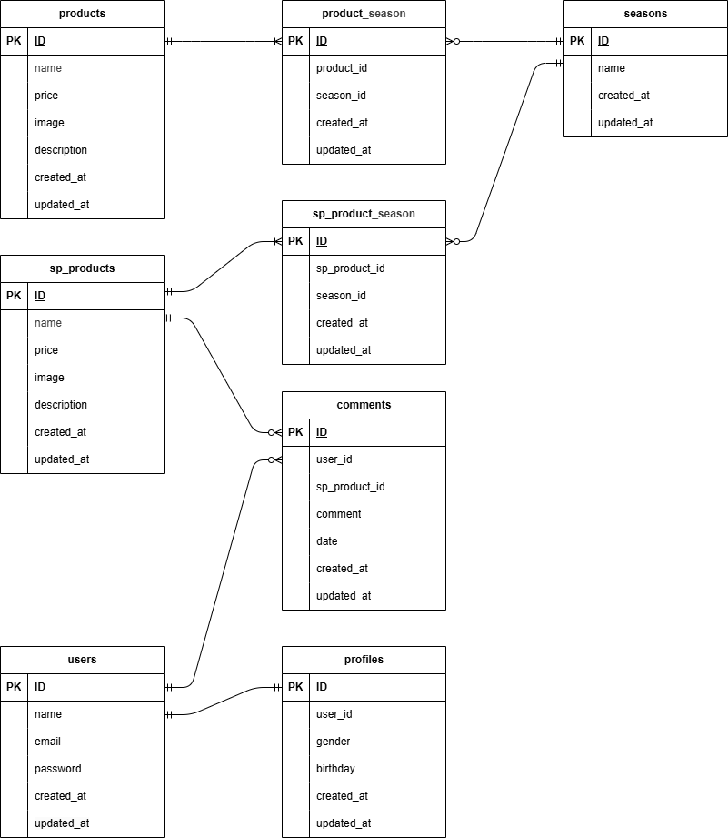

## アプリケーション名
もぎたて


## 環境構築
リポジトリからダウンロード
```
git clone https://github.com/sazenshinji/shigeno-kadai1.git
```
「.env.example」をコピーして「.env」を作成し DBの設定を変更
```
cp .env.example .env
```
```
DB_CONNECTION=mysql
DB_HOST=mysql
DB_PORT=3306
DB_DATABASE=laravel_db
DB_USERNAME=laravel_user
DB_PASSWORD=laravel_pass
```
dockerコンテナを構築
```
docker-compose up -d --build
```
phpコンテナにログインしてLaravelをインストール
```
docker-compose exec php bash
composer install
```
アプリケーションキーを作成
```
php artisan key:generate
```
DBのテーブルを作成
```
php artisan migrate
```
DBのテーブルにダミーデータを投入
```
php artisan db:seed
```
"The stream or file could not be opened"エラーが発生した場合
srcディレクトリにあるstorageディレクトリに権限を設定
```
chmod -R 777 storage
```

## 使用技術(実行環境)
PHP 7.4.9 (cli) (built: Sep  1 2020 02:33:08) ( NTS )

Laravel Framework 8.83.8

mysql  Ver 8.0.26 for Linux on x86_64 (MySQL Community Server - GPL)

nginx version: nginx/1.21.1


## URL
商品一覧：http://localhost/products/

商品詳細：http://localhost/products/{productId}

商品登録：http://localhost/products/register


## ER図


